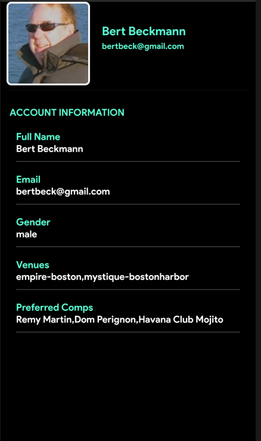

# profile

Create (or update) a user profile page. The page looks like this:



## Getting Started

The following needs to be done:

1. The user needs to be able to upload or modify their picture
2. The "Venue" setting needs to be populated using a drop down list driven by a json list
3. The "Preferred Comps" setting need to be populated using a drop down list driven by a json list

The lists are:

```
"Venues": [
    "Empire-Boston",
    "Mystique-BostonHarbor",
    (more to be added)
]

"Preferred Comps": [
    "Remy Martin",
    "Dom Perignon",
    "Havana Club Mojito",
    (more to be added)
]
```

